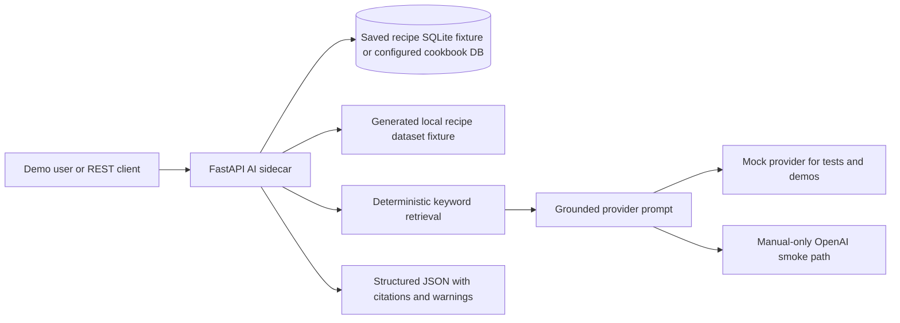

# AI Portfolio Showcase

## Executive Summary

This project demonstrates an offline-first AI application architecture with a FastAPI sidecar, deterministic retrieval, grounded provider prompts, citations/provenance, offline evals, and manual live provider validation.

Vanilla Cookbook remains the application being extended. The `ai-api` sidecar adds AI workflows without requiring production storage changes, vector databases, embeddings, raw dataset commits, or live provider calls during normal validation.

The final acceptance review is documented in [AI Feature Completion Review](ai-feature-completion-review.md).

## Architecture



The important design choice is retrieval before generation. Saved-recipe Q&A and dataset ask both select bounded context first, then ask the provider to synthesize from that context. Dataset answers cite source IDs, source files, license, and source URLs where available.

## Completed Features

| Workflow | Endpoint or Script | What It Demonstrates |
| --- | --- | --- |
| Health/config | `GET /health`, `GET /ai/config` | Sidecar readiness and non-secret provider config. |
| Structured importer | `POST /ai/import-recipe` | Schema-constrained recipe drafts from pasted text. |
| Ask My Cookbook | `POST /ai/ask` | RAG over saved recipes with citations. |
| Dataset search | `GET /dataset/search`, `POST /dataset/search` | Bounded deterministic retrieval over generated local dataset fixtures. |
| Dataset Ask/RAG | `POST /dataset/ask` | Grounded dataset answers with provenance citations. |
| Meal planning | `POST /ai/meal-plan` | Plans built from saved recipe candidates. |
| Offline evals | `evals/ai_cookbook/run_evals.py` | Repeatable quality checks with generated fixtures. |
| Live provider smoke | `scripts/smoke-openai-live.py` | Manual proof that the OpenAI provider path works. |

## Validation Evidence

- `ai-api/tests` covers config, provider harness, schema normalization, importer, RAG, dataset adapter/index/search/RAG, meal planning, and no-write/no-artifact boundaries.
- `evals/ai_cookbook/run_evals.py` covers dataset ask, saved-recipe ask, importer, meal planning, provider config hygiene, citations, and secret-like leakage checks.
- `scripts/validate-repo.sh` runs repository validation with mock/offline behavior.
- Live OpenAI smoke tests are manual-only, opt-in, budget-capped, and documented separately.

Recorded manual live OpenAI validation:

```text
provider=openai
model=gpt-5.4-nano
live_calls=4
estimated_usage_tokens=1200
workflows=importer,ask_my_cookbook,dataset_ask,meal_plan
budget_cents=25
status=passed
```

## Demo Commands

Run the safe mock demo:

```powershell
cd C:\Users\scott\cookbook-roadmaps-link
.\scripts\demo-ai-mock.ps1
```

Run normal offline evals directly:

```powershell
& .\.venv\Scripts\python.exe evals\ai_cookbook\run_evals.py
```

Optional live OpenAI smoke validation:

```powershell
$env:AI_PROVIDER="openai"
$env:OPENAI_ENABLE_LIVE_TESTS="true"
$env:OPENAI_LIVE_TEST_BUDGET_CENTS="25"
$env:AI_MAX_OUTPUT_TOKENS="200"
# OPENAI_API_KEY must come from local ignored .env or the process environment.
.\scripts\demo-ai-live-smoke.ps1
```

The live command exits cleanly without live calls unless explicitly opted in.

## Interview Talk Track

1. The project starts as a GitOps deployment lab for Vanilla Cookbook.
2. The AI work adds a FastAPI sidecar instead of rewriting the app or changing production storage.
3. Retrieval is deterministic and local, so tests and demos can prove grounding without provider cost.
4. Provider calls are isolated behind a mock/OpenAI harness; the mock path is the default for validation.
5. Offline evals catch citation failures, schema drift, no-match behavior, and obvious secret leakage.
6. A manual live smoke path proves the real OpenAI provider integration across importer, saved-recipe ask, dataset ask, and meal planning.

## Freelance Or Customer Positioning

This is a credible small AI application pattern for teams that want practical AI features without committing early to expensive infrastructure. It shows how to add useful AI workflows around existing data, keep validation deterministic, separate live-provider risk from CI, and document data boundaries before production hardening.

It is not presented as a finished production AI platform. It is a working, testable feature slice with clear limits and a path to future hardening.

## Future Roadmap Boundaries

Future work should focus on review and hardening before new infrastructure:

- screenshot capture from mock fixtures only;
- acceptance matrix for portfolio demos;
- production storage design only in a separately scoped task;
- no embeddings, vector database, Qdrant, Postgres, pgvector, persistent generated indexes, or Cloudflare/deployment changes unless a later task explicitly approves them.
