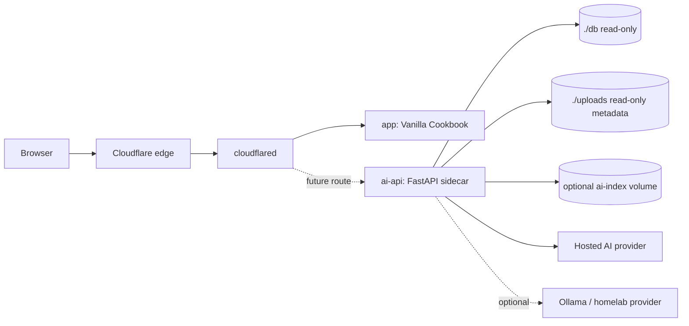

# AI Sidecar Architecture

The first AI phase adds a FastAPI sidecar beside the existing Vanilla Cookbook container. The cookbook app remains a black box while the sidecar reads recipe data safely and exposes AI-oriented APIs.

## Proposed Service Diagram



## Services

- `app`: existing `jt196/vanilla-cookbook:stable` container. It owns the user-facing cookbook UI and writes to `./db` and `./uploads`.
- `cloudflared`: existing outbound tunnel. It keeps EC2 web ports closed.
- `ai-api`: current Python/FastAPI sidecar scaffold with `GET /health`, `GET /ai/config`, deterministic recipe search endpoints, a structured recipe import draft endpoint, Ask My Cookbook RAG endpoint, an internal SQLite schema inspector, a read-only recipe reader, and an AI provider harness. Embeddings and meal planner are not implemented yet.
- `ai-index`: optional volume for a future search or embeddings index. It should be rebuildable from cookbook data.

## Why Sidecar First

- Keeps the existing app deployable and recoverable.
- Avoids changing unknown internals of the cookbook image.
- Allows independent tests, evals, and provider mocks.
- Lets the AI layer fail without taking down the core cookbook UI.
- Makes portfolio architecture clearer: black-box app plus typed AI service.

## Data Access

The sidecar reader opens SQLite databases with URI `mode=ro`. Production Compose DB mounting is deferred until the real Vanilla Cookbook schema is inspected; when added, the mount should be read-only, such as `./db:/data/cookbook-db:ro`. The future path is configurable with `COOKBOOK_DB_PATH`.

The current reader is tested against generated fixture databases. It conservatively detects recipe-like tables and returns normalized `RecipeDocument` objects. Deterministic search operates over those documents in memory and does not write to the cookbook database. If write-back is ever needed, it should be a later reviewed task with backup, migration, and rollback rules.

The sidecar may read upload metadata later, but should not parse or mutate uploaded files in the first reader task.

## API Endpoint Proposal

Current endpoints:

```text
GET  /health
GET  /ai/config
GET  /recipes/search?q=
POST /recipes/search
POST /ai/import-recipe
POST /ai/ask
```

Future endpoints:

```text
POST /ai/meal-plan
```

Endpoint notes:

- `GET /health`: process health, version, and dependency status without secrets.
- `GET /ai/config`: non-secret provider availability booleans only.
- `GET /recipes/search?q=`: simple browser-friendly deterministic keyword search.
- `POST /recipes/search`: JSON-body deterministic search with query and limit.
- `POST /ai/import-recipe`: schema-constrained parse of pasted recipe text into a draft recipe JSON object; no database write-back.
- `POST /ai/ask`: retrieval-augmented answer over saved recipes with cited recipe IDs/titles/snippets.
- `POST /ai/meal-plan`: structured meal plan and shopping list from saved recipes.

## Provider Abstraction

Use a small provider interface so endpoint logic is not tied to one SDK. The default provider is `mock`, so local validation and CI stay offline and deterministic. OpenAI is the first real provider path for later manual smoke testing.

Provider order:

1. Mock provider for tests and offline evals.
2. OpenAI first for the initial hosted implementation.
3. Anthropic and Google later behind the same interface.
4. Ollama as optional homelab mode through `OLLAMA_BASE_URL`.

OpenAI defaults:

```text
OPENAI_MODEL=gpt-5.4-nano
OPENAI_FALLBACK_MODEL=gpt-5.4-mini
```

The abstraction should support:

- text generation for RAG answers;
- structured output for importer and meal-plan schemas;
- deterministic fake responses for tests;
- provider timeout and error normalization.

Cost controls:

- run deterministic recipe search before any future model call;
- keep prompts small and task-specific;
- cap output with `AI_MAX_OUTPUT_TOKENS`;
- keep automated tests on the mock provider;
- require opt-in manual live tests for OpenAI.

The importer uses the provider harness for structured output, validates the provider response with Pydantic, and returns a draft only. It does not write to Vanilla Cookbook tables or files.

Ask My Cookbook runs deterministic keyword retrieval first, sends only the retrieved recipe context to the provider, and returns citations with recipe IDs, titles, and snippets. No-match questions return a controlled no-match answer without calling the provider or inventing recipes. It does not add embeddings, vector storage, meal planning, shopping lists, bulk ingestion, or write-back.

## Secrets And Config

Secrets stay in GitHub Actions secrets and the deployed `.env` file. Provider keys are configured outside the repository and are never returned by `/ai/config`.

```text
ANTHROPIC_API_KEY
GOOGLE_API_KEY
```

Non-secret config can stay in variables or `.env`:

```text
OLLAMA_BASE_URL
AI_PROVIDER
AI_MODEL
AI_MAX_OUTPUT_TOKENS
AI_TIMEOUT_SECONDS
OPENAI_MODEL
OPENAI_FALLBACK_MODEL
OPENAI_ENABLE_LIVE_TESTS
AI_MAX_RETRIEVED_RECIPES
```

Rules:

- Do not log provider keys.
- Do not return raw environment values, model strings, base URLs, token fragments, or provider keys from `/ai/config`.
- CI must pass without live provider secrets.
- The sidecar should detect provider availability without making startup depend on paid APIs.

## Exposure Model

The first implementation can keep `ai-api` internal to the Compose network. Later exposure options:

- route a path such as `/ai/*` through Cloudflare Tunnel to `ai-api`;
- add a small UI inside the sidecar and route it through Cloudflare;
- proxy AI requests through the cookbook app only if the app is later forked.

Do not open inbound EC2 HTTP/HTTPS ports. Keep the Cloudflare Tunnel as the public entry point.

## Risks And Unknowns

- Cookbook production SQLite schema is not documented in this repo yet.
- Concurrent reads must not interfere with cookbook writes.
- Recipe ingredient/instruction fields may need normalization.
- Hosted AI calls add cost, latency, and provider failure modes.
- OpenAI live calls are manual-only until cost controls and endpoint-specific prompts are reviewed.
- t3.micro memory and CPU limit local indexing and local LLM use.
- RAG answers can hallucinate unless retrieval, citations, and no-match behavior are tested; current tests cover these behaviors with the mock provider.
- Importer write-back is risky and intentionally out of scope; the current importer returns draft JSON only.
