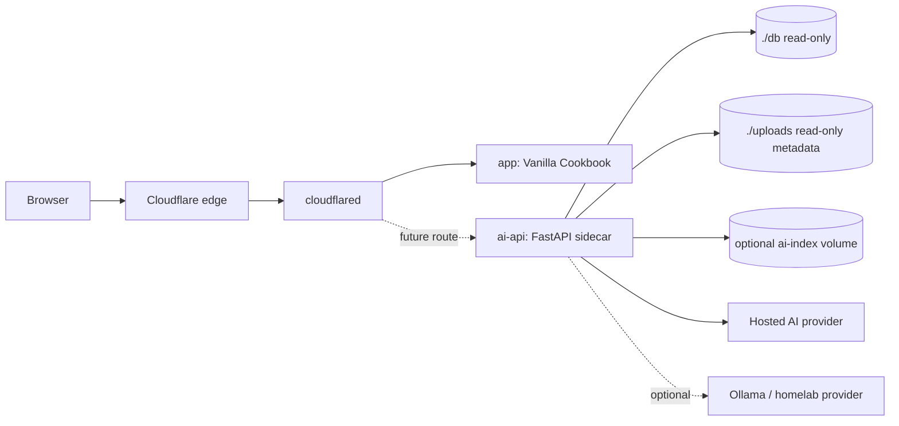

# AI Sidecar Architecture

The first AI phase adds a FastAPI sidecar beside the existing Vanilla Cookbook container. The cookbook app remains a black box while the sidecar reads recipe data safely and exposes AI-oriented APIs.

## Proposed Service Diagram



## Services

- `app`: existing `jt196/vanilla-cookbook:stable` container. It owns the user-facing cookbook UI and writes to `./db` and `./uploads`.
- `cloudflared`: existing outbound tunnel. It keeps EC2 web ports closed.
- `ai-api`: proposed Python/FastAPI sidecar for search, RAG, importer, meal planner, and config inspection.
- `ai-index`: optional volume for a future search or embeddings index. It should be rebuildable from cookbook data.

## Why Sidecar First

- Keeps the existing app deployable and recoverable.
- Avoids changing unknown internals of the cookbook image.
- Allows independent tests, evals, and provider mocks.
- Lets the AI layer fail without taking down the core cookbook UI.
- Makes portfolio architecture clearer: black-box app plus typed AI service.

## Data Access

The sidecar should mount the cookbook SQLite database read-only. It should start with a read-only recipe reader and deterministic search. If write-back is ever needed, it should be a later reviewed task with backup, migration, and rollback rules.

The sidecar may read upload metadata later, but should not parse or mutate uploaded files in the first reader task.

## API Endpoint Proposal

```text
GET  /health
GET  /recipes/search?q=
POST /recipes/search
POST /ai/ask
POST /ai/import-recipe
POST /ai/meal-plan
GET  /ai/config
```

Endpoint notes:

- `GET /health`: process health, version, and dependency status without secrets.
- `GET /recipes/search?q=`: simple browser-friendly deterministic search.
- `POST /recipes/search`: structured search options such as tags, ingredients, and limit.
- `POST /ai/ask`: retrieval-augmented answer over saved recipes with cited recipe IDs/titles.
- `POST /ai/import-recipe`: schema-constrained parse of pasted recipe text into a draft recipe JSON object.
- `POST /ai/meal-plan`: structured meal plan and shopping list from saved recipes.
- `GET /ai/config`: non-secret provider availability, feature flags, and model names if safe to show.

## Provider Abstraction

Use a small provider interface so endpoint logic is not tied to one SDK.

Provider order:

1. OpenAI first for the initial hosted implementation.
2. Anthropic and Google later behind the same interface.
3. Ollama as optional homelab mode through `OLLAMA_BASE_URL`.
4. Mock provider for tests and offline evals.

The abstraction should support:

- text generation for RAG answers;
- structured output for importer and meal-plan schemas;
- deterministic fake responses for tests;
- provider timeout and error normalization.

## Secrets And Config

Secrets stay in GitHub Actions secrets and the deployed `.env` file:

```text
OPENAI_API_KEY
ANTHROPIC_API_KEY
GOOGLE_API_KEY
```

Non-secret config can stay in variables or `.env`:

```text
OLLAMA_BASE_URL
AI_PROVIDER
AI_MODEL
AI_REQUEST_TIMEOUT_SECONDS
AI_MAX_RETRIEVED_RECIPES
```

Rules:

- Do not log provider keys.
- Do not return raw environment values from `/ai/config`.
- CI must pass without live provider secrets.
- The sidecar should detect provider availability without making startup depend on paid APIs.

## Exposure Model

The first implementation can keep `ai-api` internal to the Compose network. Later exposure options:

- route a path such as `/ai/*` through Cloudflare Tunnel to `ai-api`;
- add a small UI inside the sidecar and route it through Cloudflare;
- proxy AI requests through the cookbook app only if the app is later forked.

Do not open inbound EC2 HTTP/HTTPS ports. Keep the Cloudflare Tunnel as the public entry point.

## Risks And Unknowns

- Cookbook SQLite schema is not documented in this repo yet.
- Concurrent reads must not interfere with cookbook writes.
- Recipe ingredient/instruction fields may need normalization.
- Hosted AI calls add cost, latency, and provider failure modes.
- t3.micro memory and CPU limit local indexing and local LLM use.
- RAG answers can hallucinate unless retrieval, citations, and no-match behavior are tested.
- Importer write-back is risky and intentionally out of scope for the first version.
